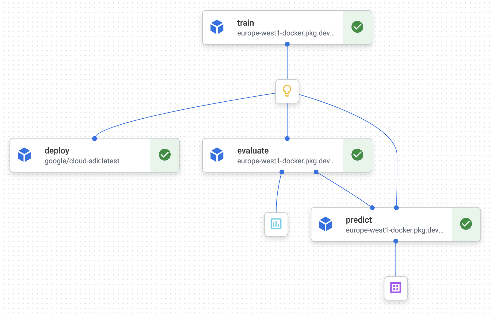

# MLOps in GCP

 This is a ML model that automatically classifies uploaded images into preset categories (e.g. bag, sneaker, etc.) to assign labels to fashion articles.

- Train a model locally
- Serve the model with FastAPI
- Containerize and deploy the application to Google Cloud Run
- Track metrics in Google Cloud Monitoring
- Enable continuous retraining with Vertex AI and Kubeflow Pipelines
- Automate the deployment with CI/CD

## Prerequisites

- Google cloud CLI installed, e.g. use `brew install google-cloud-sdk` or see [these intructions](https://cloud.google.com/sdk/docs/install). Check by running: `gcloud --version`.
- Poetry installed (see [these instructions](https://python-poetry.org/docs/#installation)). Check by running: `poetry --version`.
- Docker installed (see [these instructions](https://docs.docker.com/get-docker/)). Check by running: `docker --version`.

Then run `make init` to install the dependencies. The dependencies are defined in `pyproject.toml`. 

## VertexAI pipeline

